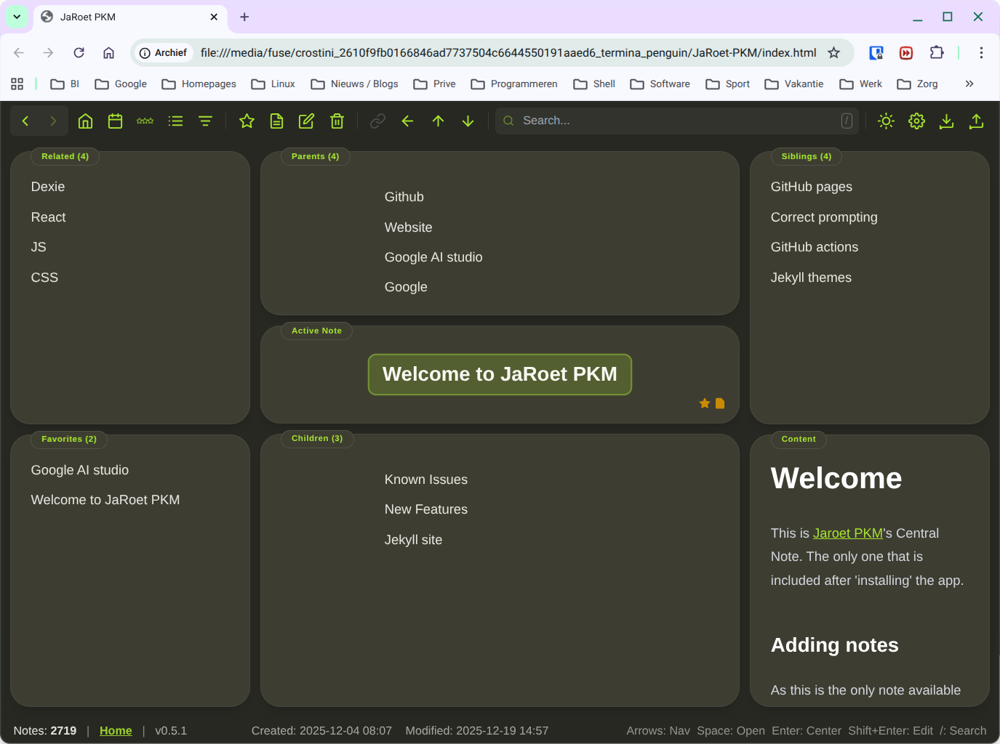

JaRoet PKM is a fast, local-first Personal Knowledge Management tool designed for keyboard power users. It moves away from traditional folder structures, organizing your notes based on their relationships (Parents, Children, Siblings, and Related items). This creates a natural "topology" of thought that you can navigate fluidly. 

There is complete [documentation](./documentation.md) and you can also check the [changelog](./changelog.md). 

The functions are inspired by software like [TheBrain](https://www.thebrain.com), [Workflowy](https://www.workflowy.com), [Logseq](https://www.logseq.com) and [Obsidian](https://www.obisidian.md).

