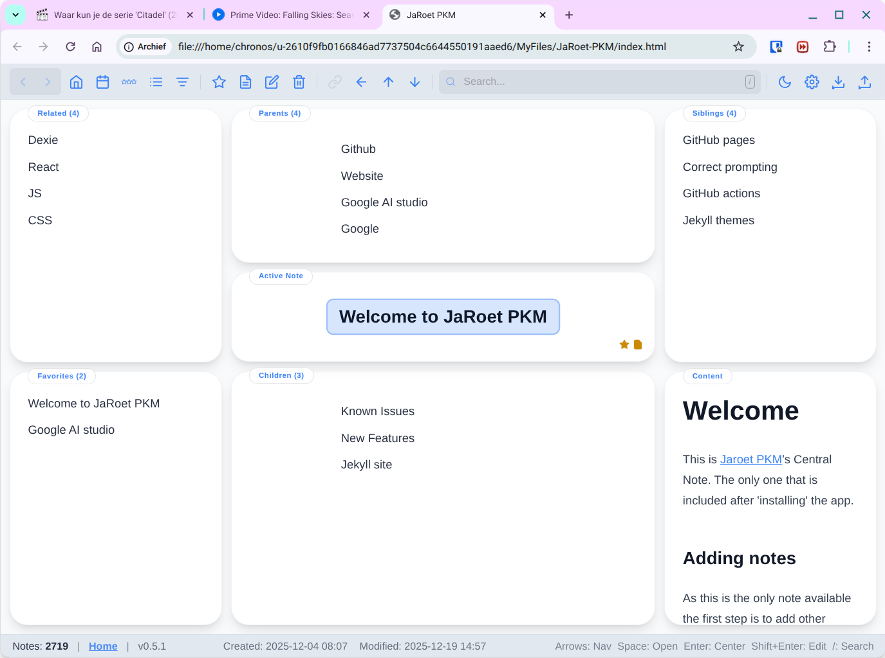

[Github repository](https://github.com/jaroet/jaroet-pkm){: .btn } [Discord](https://discord.com/channels/1458852555135123722){: .btn }

# Welcome to JaRoet PKM

**JaRoet PKM** is a fast, local-first Personal Knowledge Management tool designed for keyboard power users. It moves away from traditional folder structures, organizing your notes based on their relationships (Parents, Children, Siblings, and Related items). This creates a natural "topology" of thought that you can navigate fluidly.

### 🚀 [Explore All Features](./features.md)

Check out the **[Features Page](./features.md)** to see what JaRoet can do, or dive straight into the **[Documentation](./documentation.md)** to get started.

---

### Philosophy
The functions are inspired by software like [TheBrain](https://www.thebrain.com), [Workflowy](https://www.workflowy.com), [Logseq](https://www.logseq.com) and [Obsidian](https://www.obsidian.md).

*   **No Installation**: Runs from a single HTML file.
*   **Private**: Data lives in your browser (IndexedDB).
*   **Fast**: Built for speed and keyboard navigation.